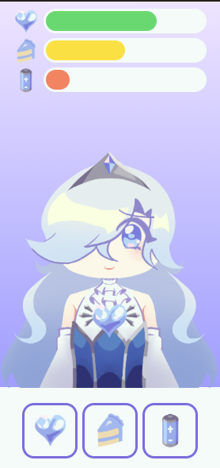
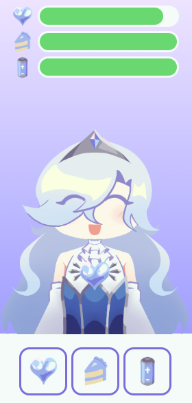

# Spinagotchi

A simple Tamagotchi-style desktop app based on my partner’s original character.  named Spinarosa.
Built with **React** and **Tailwind CSS**, and packaged as a desktop application using **Electron.js**.

##  About the Project

This project is a digital Tamagotchi where you take care of a virtual character by managing three core stats. Each stat has a corresponding button that lets you raise it and keep your Tamagotchi happy and alive.

### Stats
- **Hunger** – Feed your Tamagotchi
- **Love** – Show affection and care
- **Energy** – Let the tamagotchi rest

Each stat decreases over time, and your tamagotchi will "die" if left alone for too long.

### Main Screen

### Happy / Healthy State

## 

### Tech Stack
- **React** – UI and state management  
- **Tailwind CSS** – Styling and layout  
- **Electron.js** – Exporting the app as a desktop application

